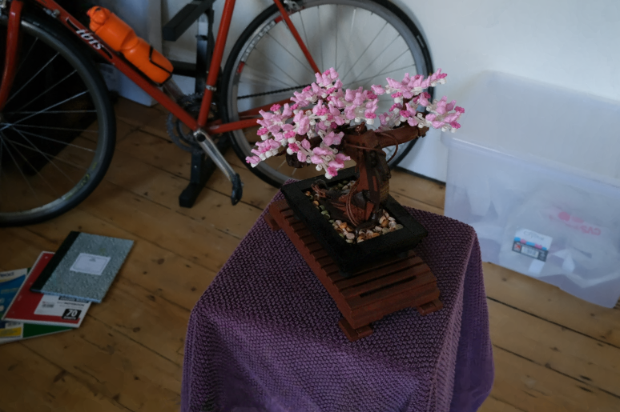

# Vulkan RadFoam Real-Time Ray Tracing Renderer

[](LICENSE)

This project is a partial implementation of the [RadFoam](https://radfoam.github.io/) paper, featuring a real-time ray tracing renderer built with the Vulkan SDK. It supports user navigation and novel view synthesis, with a focus on familiarizing myself with Vulkan and improving rendering performance.


---

## Key Features ✨

- **Real-Time Ray Tracing**: Built using Vulkan and GLSL for efficient rendering
- **User Navigation**: Intuitive keyboard controls for 6-DOF scene exploration
- **High Performance**: Optimized for fast rendering speeds (200+ FPS)

---

## Current Limitations ⚠️
- **Platform Support**: Currently limited to Windows Vulkan implementations

---

## Build and Run 🛠️

### Prerequisites
- [xmake](https://xmake.io/) build system
- Vulkan SDK 1.3+
- GPU with Vulkan 1.3 support

### Quick Start

⚠️ Note: The original repository's SH coefficient serialization may cause color artifacts. Use the included conversion tool to fix this issue before rendering.

#### Step 1: Clone and prepare
```bash
git clone https://github.com/lzlcs/vulkan-radfoam-viewer.git
cd vulkan-radfoam-viewer
```
#### Step 2: Fix color artifacts
```bash
# Run in your RadFoam environment
python convert.py -c [path/to/checkpoint]/config.yaml
```
▸ Input: RadFoam checkpoint directory config file
▸ Output: `sh_scene.ply` with corrected color data

#### Step 3: Build and run
```bash
xmake b
xmake r radfoam-vulkan-viewer [path/to/checkpoint]/sh_scene.ply
```

## User Controls 🎮
| Movement        | Rotation           |
|-----------------|--------------------|
| `W` - Forward   | `J` - Roll Left    |
| `S` - Backward  | `L` - Roll Right   |
| `A` - Left      | `I` - Tilt Up      |
| `D` - Right     | `K` - Tilt Down    |
| `Q` - Ascend    | `U` - Rotate CW    |
| `E` - Descend   | `O` - Rotate CCW   |

---

## Future Roadmap 🚀
1. 🔄 Dynamic swapchain recreation for window resizing
2. 🎛️ Enhanced camera control parameters
3. 📱 Cross-platform support (Android/MacOS Metal)
4. 🧩 Modular architecture refactoring
5. 🎨 Advanced material system integration

---

## Acknowledgments 🙏
- Inspired by [RadFoam](https://radfoam.github.io/) research
- Built with [Vulkan Memory Allocator](https://github.com/GPUOpen-LibrariesAndSDKs/VulkanMemoryAllocator)
- Built with [GLFW](https://www.glfw.org/)

---

## License 📜
This project is licensed under the **MIT License** - see the [LICENSE](LICENSE) file for details.

---

## Contact 📧
For questions/suggestions:  
[lzlcs](mailto:3012386836@qq.com) | [GitHub Issues](https://github.com/lzlcs/vulkan-radfoam-viewer/issues)
